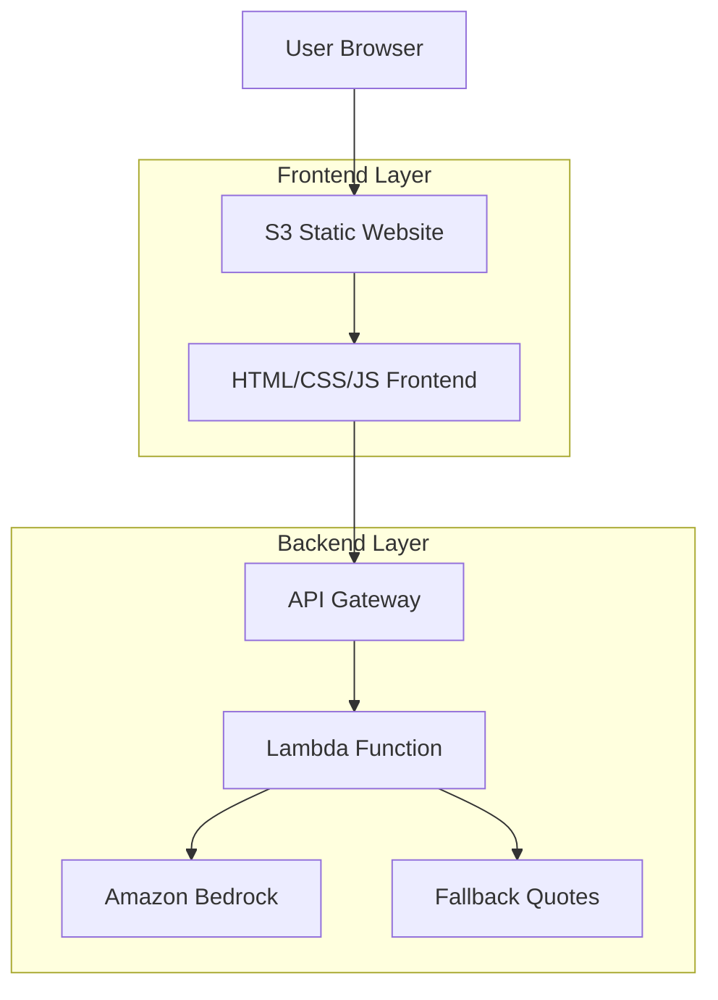

# Design Document

## Overview

This design outlines the implementation of a minimalistic web frontend for personalized daily quotes, integrating with the existing AWS Lambda function and Amazon Bedrock AI. The solution uses S3 static website hosting for simplicity and cost-effectiveness.

## Architecture



## Components and Interfaces

### Frontend Components

#### 1. HTML Structure (`index.html`)
- **Purpose**: Provides the basic page structure and semantic markup
- **Key Elements**:
  - Name input field with validation
  - Submit button with loading states
  - Quote display area
  - Error message container
- **Accessibility**: Proper ARIA labels, semantic HTML, keyboard navigation

#### 2. CSS Styling (`style.css`)
- **Purpose**: Provides responsive, minimalistic styling
- **Design Principles**:
  - Mobile-first responsive design
  - Clean, modern aesthetic
  - High contrast for accessibility
  - Smooth animations for user feedback
- **Key Features**:
  - Flexbox layout for centering
  - CSS Grid for responsive quote display
  - Loading spinner animations
  - Error state styling

#### 3. JavaScript Logic (`script.js`)
- **Purpose**: Handles user interactions and API communication
- **Key Functions**:
  - `submitForm()`: Validates input and triggers quote generation
  - `fetchQuote(name)`: Makes API call to Lambda function
  - `displayQuote(data)`: Updates UI with received quote
  - `showError(message)`: Displays user-friendly error messages
  - `toggleLoading(state)`: Manages loading state UI

### Backend Enhancements

#### 1. Lambda Function Updates
- **Enhanced `get_energizing_quote(name=None)` function**:
  - Accepts optional name parameter
  - Generates personalized prompts for Bedrock
  - Provides personalized fallback quotes
  - Implements input sanitization

- **Updated `lambda_handler(event, context)` function**:
  - Extracts name from query parameters or POST body
  - Maintains backward compatibility
  - Enhanced CORS headers for frontend access

#### 2. API Gateway Configuration
- **CORS Settings**:
  - Allow origins: S3 website endpoint
  - Allow methods: GET, POST, OPTIONS
  - Allow headers: Content-Type, Authorization
- **Parameter Handling**:
  - Support query parameter: `?name=John`
  - Support POST body: `{"name": "John"}`

### S3 Static Website Hosting

#### 1. Bucket Configuration
- **Bucket Name**: `daily-quote-frontend-[random-suffix]`
- **Static Website Hosting**: Enabled
- **Index Document**: `index.html`
- **Error Document**: `index.html` (SPA behavior)

#### 2. Bucket Policy
```json
{
  "Version": "2012-10-17",
  "Statement": [
    {
      "Sid": "PublicReadGetObject",
      "Effect": "Allow",
      "Principal": "*",
      "Action": "s3:GetObject",
      "Resource": "arn:aws:s3:::bucket-name/*"
    }
  ]
}
```

## Data Models

### API Request Format
```javascript
// Query Parameter Method
GET /quote?name=John

// POST Body Method
POST /quote
{
  "name": "John"
}
```

### API Response Format
```javascript
{
  "quote": "John, today is your day to shine and make a difference! Embrace every challenge as an opportunity to grow stronger.",
  "timestamp": "request-id-12345",
  "model": "amazon.titan-text-express-v1",
  "personalized": true
}
```

### Frontend State Model
```javascript
const appState = {
  isLoading: false,
  currentQuote: null,
  userName: "",
  error: null,
  lastRequestTime: null
};
```

## Correctness Properties

*A property is a characteristic or behavior that should hold true across all valid executions of a system-essentially, a formal statement about what the system should do. Properties serve as the bridge between human-readable specifications and machine-verifiable correctness guarantees.*

### Property 1: Name Input Validation
*For any* user input string, the frontend should reject empty or whitespace-only names and provide appropriate feedback
**Validates: Requirements 1.2**

### Property 2: Personalized Quote Generation
*For any* valid name input, the Lambda function should generate a quote that includes the user's name in a natural, motivational context
**Validates: Requirements 3.1, 3.2**

### Property 3: API Communication Reliability
*For any* API request from the frontend, the system should handle both successful responses and error conditions gracefully without breaking the user interface
**Validates: Requirements 4.4, 4.5**

### Property 4: Responsive Design Consistency
*For any* screen size between 320px and 1920px width, the interface should remain functional and readable
**Validates: Requirements 5.1, 5.2**

### Property 5: Backward Compatibility
*For any* API request without a name parameter, the system should generate generic quotes maintaining existing functionality
**Validates: Requirements 3.3**

### Property 6: Input Sanitization Security
*For any* user input containing special characters or potential injection attempts, the system should sanitize the input safely
**Validates: Requirements 3.5**

## Error Handling

### Frontend Error Scenarios
1. **Network Errors**: Display "Unable to connect. Please check your internet connection."
2. **API Errors**: Display "Service temporarily unavailable. Please try again."
3. **Invalid Input**: Display "Please enter a valid name."
4. **Timeout**: Display "Request timed out. Please try again."

### Backend Error Scenarios
1. **Bedrock Throttling**: Return personalized fallback quotes
2. **Invalid Name Input**: Sanitize and proceed or return error
3. **Missing Parameters**: Default to generic quote generation
4. **Service Unavailable**: Return appropriate HTTP status codes

## Testing Strategy

### Unit Testing
- **Frontend**: Test individual JavaScript functions with mock API responses
- **Backend**: Test Lambda function with various name inputs and edge cases
- **Validation**: Test input sanitization and error handling

### Integration Testing
- **API Integration**: Test frontend-to-Lambda communication
- **Cross-browser**: Test on major browsers (Chrome, Firefox, Safari, Edge)
- **Device Testing**: Test responsive design on various screen sizes

### Property-Based Testing
- **Input Validation**: Generate random strings to test name validation
- **Quote Personalization**: Verify quotes contain provided names
- **Error Handling**: Test various failure scenarios
- **Performance**: Test with concurrent users and rate limiting

### End-to-End Testing
- **User Workflow**: Complete user journey from name input to quote display
- **Error Recovery**: Test error scenarios and recovery paths
- **Accessibility**: Test with screen readers and keyboard navigation

## Deployment Strategy

### Infrastructure as Code
- Update existing SAM template to include S3 bucket
- Add bucket policy and website configuration
- Maintain single-stack deployment

### Deployment Process
1. **Backend Deployment**: Deploy enhanced Lambda function
2. **Frontend Build**: Prepare static assets
3. **S3 Upload**: Deploy frontend files to S3 bucket
4. **Testing**: Verify end-to-end functionality
5. **Documentation**: Update README with frontend URL

### Rollback Strategy
- Keep previous Lambda version for quick rollback
- Maintain separate S3 bucket versions if needed
- Monitor CloudWatch logs for issues